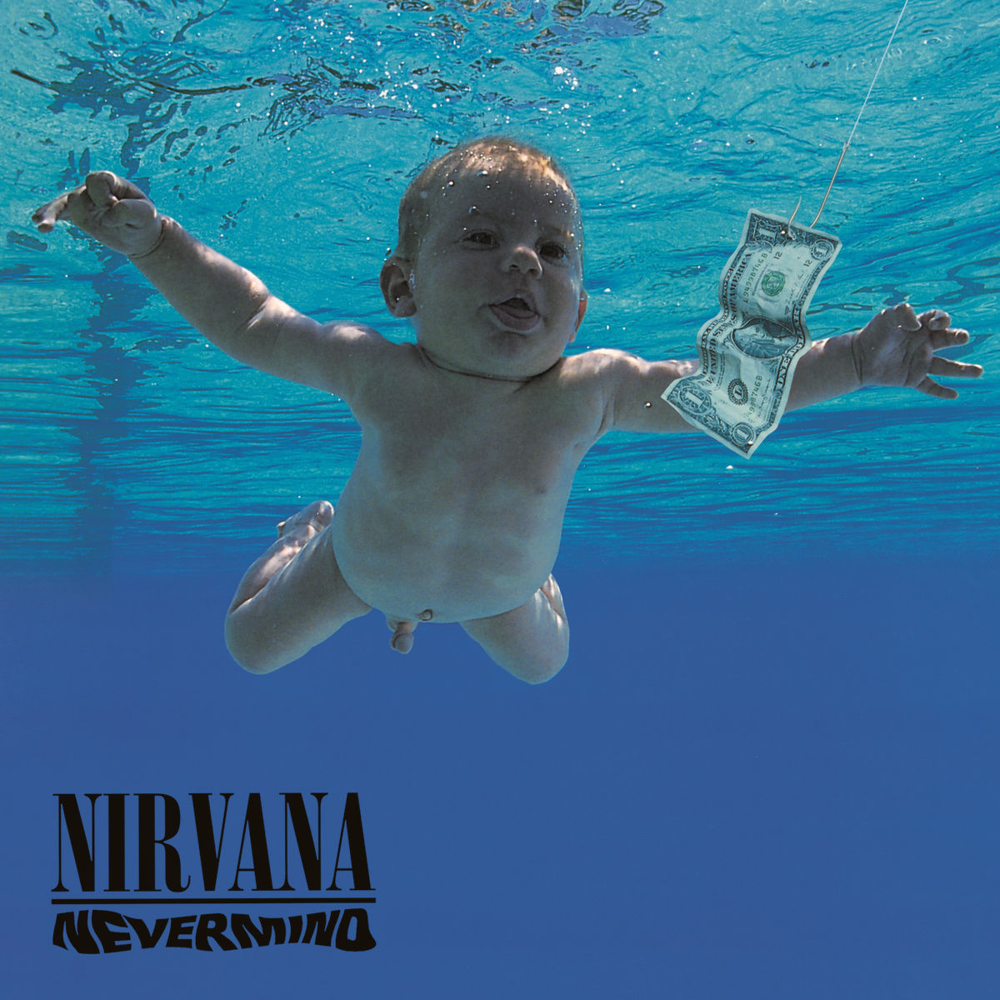

## [Nevermind](https://en.wikipedia.org/wiki/Nevermind)

想写这张纯粹是因为最近开始游泳了。上次真正的游泳还是在科大的时候，已经是两年前了。

周五时候重新熟悉了动作，游了四百米。今天，或者说昨天，周一，游了六百米，很轻松。

两年前在科大的时候经常和Justin，韩晖在“下班”后一起去游，游累了以后去麦记下面的餐厅吃晚饭。科大的餐厅份量都很大，不知道为什么。这张专辑和那段日子联系起来，纯粹是因为在我能游连续的五十米了以后高兴，拿专辑封面当配图发了个朋友圈。我说我打成了新成就，结果大家都以为是我裸泳了…韩晖教了我不少东西，他爹以前是市游泳队的。在他的引导下，我最终得以达成这个成就。之所以说是成就，因为以前的我自由泳不会换气的。

科大的泳池和中大很不一样。中大的是两边浅而中间深，坐在女工边的台阶上很容易就看出来了。我在中大一共也就游过两次，大一水运会之前的准备和水运会。仰泳五十米，比倒数第二慢了快一分钟。不在中大游的原因很简单，女工附近总是有很多人，泳池一览无余，太羞耻了。科大的池子一边浅一边深，深水区有三米了吧。从浅水区游到深水区的时候看着地面，感觉自己像起飞了一样，太爽了。

回到这张专辑，“娃游泳”。已经不记得什么时候开始听Nirvana了，大概是从那个滚石的100首歌开始吧。应该是从Smells Like Teen Spirit入的坑。从徐神那里听到了一个故事。高中的时候我在课间放Smells Like Teen Spirit，徐神问我这啥歌，我说你这都不知道？然后徐神就开始Smells Like Teen Spirit了。从他那我还知道了Teen Spirit是个除臭剂，deoderant。高中时候中的Nirvana的毒，电驴上下了所有的专辑，最喜欢的几张之一当然要包括Nevermind。有一些歌是越听越有味道的，比如Come As You Are, Lithium。

我有这张专辑两张CD，一个是Deluxe版，里面似乎有两张，一个是初版。并不能记起来先买的哪张。初版是二手的，毕竟生产出来的时候我还没出生。当时是大一暑假在Berkeley，住的地方紧挨着Berkeley Library。里面有个二手店，就花了两刀淘来了这张碟。然而这张是有一些瑕疵的，听到一些地方会有杂音。

说自己喜欢Nirvana似乎有些俗了，说Kurt Cobain是神似乎也有些俗了。然而我还是觉得他就是神，他就是一种文化的象征，他就是九十年代最有影响的乐队。Never mind，自由自在就好，管那么多干嘛，游就是了。

02:12, GMT-4  
May. 21, 2019