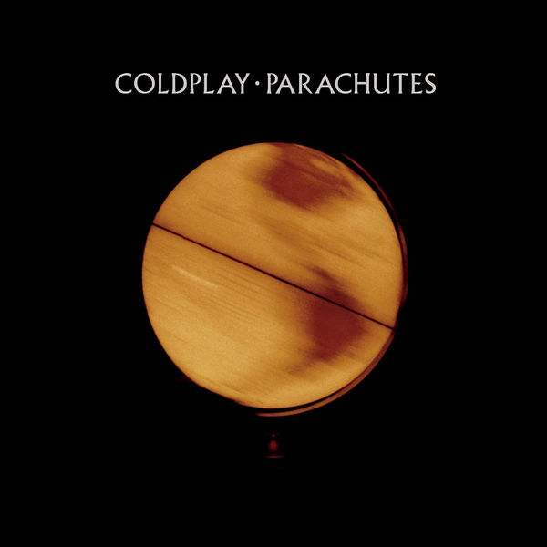

## [Parachutes](https://en.wikipedia.org/wiki/Parachutes_(album))

第一回仔细听是在大一的时候。

不记得几月份，情绪很不好，脑子一热就买了一个Bose的CD机放在宿舍。之所以要买Bose，是因为子瓷家有一个大一号的Bose，当时我觉得很不错。欧神没过多久也买了一个，Sony的。自然而然的，我俩买碟且换碟听。

有一次去何文田欧神宿舍，印象中我给了他一张Radiohead的精选集，似乎是给他打开了新世界。走的时候他给了我这张专辑，说是写作业时候听很不错。那天月亮很好看，我看了看封面，就把这张碟叫黄月亮了。

事实上不仔细看的话这张碟的封面就是黄月亮，月亮上的黑斑都有。我第一次发现它不是黄月亮而是一个转动着的地球仪已经是几年以后了。

拿回去听了，很喜欢，很喜欢整张专辑的氛围。这是一张大多数歌都很喜欢的专辑，什么意思呢，最喜欢的专辑之一。这并不是说我喜欢Coldplay，事实上后来的Coldplay和黄月亮里面的根本就是两个乐队。

再次有印象的时候是2018年的元旦，在柬埔寨。刚做完义工，在暹粒的各种石窟逛了两天。随后其他同行的人都陆续回香港了，而我和走冰没什么要紧的事情，就还待在那里吃当地的好吃的。白天没什么事情做，就去酒吧街里面瞎逛，然后在Temple二层临街的位置要了些酒喝，一起打游戏。说起来酒，实在太搞笑了。酒装在九只注射器里，注射器埋在装满了冰块的大碗里。看菜单的时候我们以为是非常小的注射器，结果个头超级大，直接被吓到了，印象中是三十毫升的。想了想才明白那个地方晚上是夜店，这是给一伙人一起喝的。然而最终我们还是喝完了，用了一下午时间。

打游戏的时候听到了街上有喇叭在放Yellow，但我不知道歌的名字，我只知道是黄月亮里面的一首。所以我就在iTunes里面找，找到然后放出来，和外面的声音同步，十分有趣。当天晚上又不知道去哪里了，就去暹粒的Hard Rock看演出，大致就是翻唱各种经典吧。中场过后不知道为什么他们开始唱Yellow，虽然一点也不hard，一点也不rock，但是我很开心。似乎Yellow是最流行的一首歌，然而我一直不知道它比其他黄月亮里面的歌好在哪，都差不多嘛。

前几天春假回家拔牙，最终几门课作业都没写完。路上奔波了一整天后终于到了在周日晚上回到了Bloomington。周一交两个作业，周二一个作业一个考试，周四一个考试。极度崩溃。数学课作业没写完这种事情，上次还是在UBC，出去浪，然后作业崩了。写不完作业，就要用掉去掉最低分的quota。还好北美有这个习惯，也还好在中大时候作业都写完了。压力特别大的时候是不会注意到生活中任何事情的，饭都是胡凑合的，没有任何精力思考数学以外的东西。周四早上的试考完后觉得整个世界都变轻松了，回家吃了十几个烤鸡翅后睡了五六个小时。睡起来买菜吃饭后，开车去湖边看星星和月亮。满月，无云。午夜去湖边的路上没什么人，CD里面旋转的就是黄月亮，突然理解了为什么有的人回家前喜欢在车里坐一会，太放松了。

03:26, GMT-4  
Mar. 22, 2018

