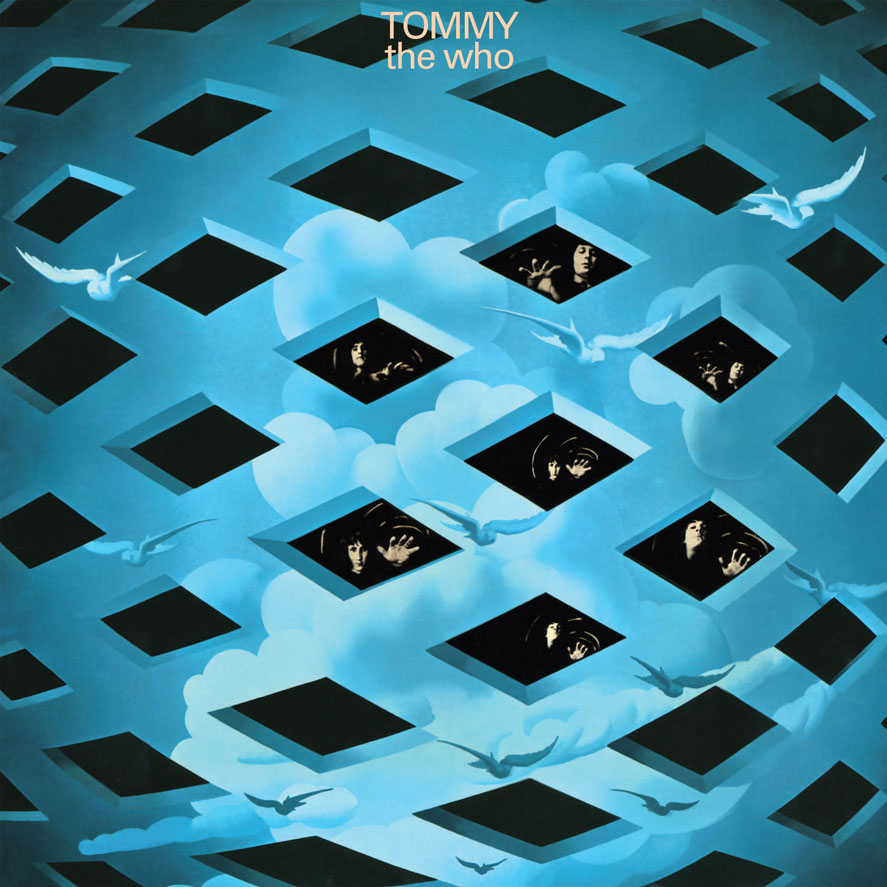
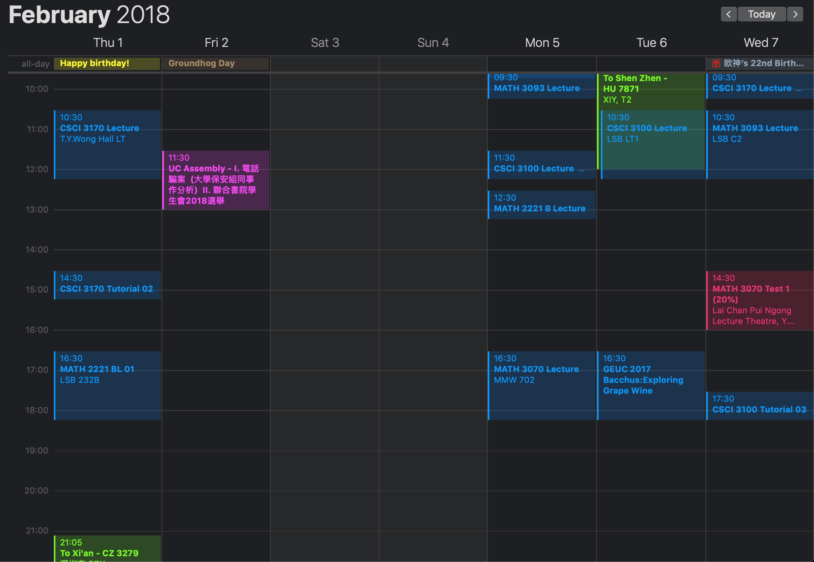

## [Tommy](https://en.wikipedia.org/wiki/Tommy_(album))

很久没有写过东西了。最近车里的CD机中放着这张碟。

最近想听这张碟是因为又怀旧了。

Tommy本身是一张很好的专辑，摇滚歌剧，讲了一个叫Tommy的男孩的悲惨故事。几乎每一首都是极好听的。不喜欢哪一首呢？没有。

上次听也是最感动的时候，是那首1921。不知不觉现在的我已经23岁了，是一个质数，和24比起来极度[nonfriable](https://en.wikipedia.org/wiki/Smooth_number)。我曾以为年岁的数字越不smooth也就意味着这一年发生的事情不smooth，颇具有迷信色彩。然而这是我大四那年所愿意相信的。

一年又几个月以前，我还是21岁。申请的焦虑过于巨大，我已无法承受。在学校什么事情都不想做，因为自知自己做的任何事情对自己即将到来的命运的审判不能带来任何影响，自己对自己的人生彻底失去了控制。最终和妈妈联系后买了机票回了家，过了完整的一个周末。回家的那天是我的生日，22岁了。

回家的目的很简单，逃避学校的一切让我烦躁的东西，等第一封拒信。我知道第一封是来自Columbia的，我也知道它会在二月一日到来，根据gradcafe上2017的数据。然而它迟到了，比春天来的晚了一天，是我走的那天早上，二月五日。

那一段时间对很多事情进行了深入，或者说不得不进行了很多思考。徐神说我是他见过最爱自省的人。一个这样的人在无所事事的情况下必然会不断地剖析自己。我在最焦虑的时候得出结论，焦虑是由巨大的不确定性产生的，或者说是由信息的缺乏产生的。怀抱希望的人都是痛苦的，因为希望就意味着不确定性，而这种不确定性可以将人撕得粉碎。能缓解焦虑的只有信息，而拒信也是一种信息。

在二月五号为了赶飞机早上六点多醒来时，看到了邮件，欣喜若狂，果然是Columbia的拒信，迟到了四天。

在机场一个人听着1921，非常地难过，非常想哭。虽然我已经不是21岁了，虽然这首歌说的也不是21岁的事情，虽然这首歌描述的是不可描述，但下面这段歌词还是让我心里说不出地难受。

		Got a feeling '21
		Is going to be a good year
		Especially if you and me
		See it in together
		I had no reason to be over optimistic
		But somehow when you smiled
		I could brave bad weather

下周要考四门final，多过任何一个人。周一早上拓扑，周二早上微分拓扑，周三下午交换代数，周五早上微分几何。根本没有时间复习啊，微分几何后边学期是一种彻底不会的状态。唉。

好不容易才总结完了拓扑，今晚还打算总结完微分拓扑。刚才在Dunn's woods转了一圈，叶子都绿了。第一次见Dunn's woods时候林子是枯的，现在又枯了一次后又绿了。没有多少时候是轻松的。

22:13, GMT-4  
Apr. 27, 2019

